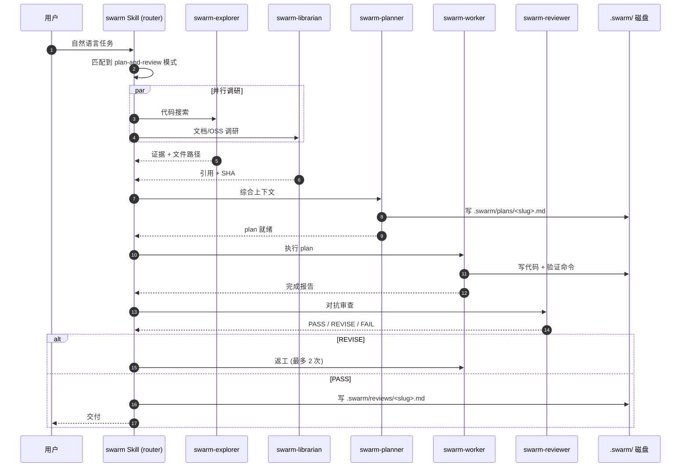

# qoder-swarm：把 Qoder CLI 变成多 Agent 协作控制室

上周我们在 Qoder CLI 里干了件离谱的事：让 qoder-swarm 给它自己修一个 bug。任务是把 `task-dag.sh` 的环检测从 26 秒压到 4 秒以内 —— `swarm-planner` 写了 plan，`swarm-worker` 把 bash awk 改成 python3 迭代 DFS，`swarm-reviewer` 找出三个边界 case 打回去返工一次，最终 6.5 倍的提速跑过了 smoke test。整个过程我们只下了一句话指令。这就是 qoder-swarm —— 一个把 Qoder CLI 变成多 Agent 控制室的 Skill：一个 router、十一种编排模式、七个分工 subagent，全部用 Qoder 原生的 Skill + Agent 机制实现，状态写盘扛 context compaction，模型分层省 60% credits。

## 为什么需要 Multi-Agent

当我们用单个 LLM agent 完成一个复杂任务时，会撞上三道硬天花板。

第一，context window 满了就遗忘。200K token 听起来很多，但一个中型项目的代码搜索结果、plan 草稿、实现尝试、review 反馈很快就会撑满。一旦 compaction 触发，早期上下文被摘要甚至丢失，agent 开始"忘记"自己做过什么。

第二，推理 + 搜索 + 实现共用一个昂贵模型，成本爆炸。用 ultimate 模型做代码搜索是杀鸡用牛刀 —— 搜索只需要理解文件结构，不需要深度推理能力。但如果只有一个 agent，所有工作都走同一个模型，credit 消耗线性增长。

第三，自己 review 自己存在 confirmation bias。让实现者审查自己的代码，等于让学生自己批改自己的试卷。人类会犯的错，LLM 同样会犯，而且更难发现自己刚写的逻辑漏洞。

举个具体的例子：让单 agent 给一个 50 文件的项目加单测。它先搜代码（吃掉 30K token），写 plan 草稿（再吃 10K），尝试实现第一个测试（又吃 15K），跑测试失败看报错（再吃 5K）—— 到 review 环节时 context 已经满了，前面的代码搜索结果被 compaction 摘要成了三行，agent 只记得"有个 utils 模块"但忘了里面有什么函数。多 agent 拆开后，explorer 搜完把结果写进文件，planner 从文件读而不是从 context 读，worker 只看 plan 不看搜索结果 —— 每个 agent 的 context 都很轻。

多 Agent 的答案不是"更聪明的 LLM"，而是更好的分工加上状态外置。同样的 LLM 容量，编排后产能翻倍 —— 这就像单 worker 和流水线的区别：不是工人变强了，而是工序拆开后并行度上去了。单 agent 串行做搜索、规划、实现、审查四件事，每件都要等前一件完成；多 agent 让 explorer 和 librarian 并行调研，planner 拿到综合上下文后写 plan，worker 按 plan 执行 —— 等待时间被压缩了。

## qoder-swarm 是什么

一句话定位：qoder-swarm 是 Qoder CLI 的多 Agent 编排套件，11 种模式加 7 个 subagent 加模型分层。它不是一个新框架，而是基于 Qoder 原生的 Skill + Agent 机制实现的编排层 —— Skill 做路由、Agent 做执行、磁盘做状态，没有引入任何额外的 runtime 依赖。你在 Qoder CLI 里已经会用 Skill 和 Agent，就会用 qoder-swarm，学习成本几乎为零。

它和原生 Qoder 的差异集中在五个维度：

| 维度 | 原生 Qoder | qoder-swarm |
|------|-----------|-------------|
| Agent 调用 | 手动 `Agent` 工具 | 自然语言触发，自动路由到 11 种 pattern |
| 模型选择 | 全局单一模型 | 7 个 subagent 各自绑定模型（免费 Qwen 到付费 GLM/Ultimate） |
| 状态持久化 | 仅 LLM 会话内存 | 磁盘 `.swarm/` 目录，扛 context compaction |
| 多 Agent 协作 | 无协议 | DAG 依赖 + 文件冲突检测 + 自协调协议 |
| 对抗审查 | 自己 review 自己 | implementer 与 reviewer 强制不同 Agent |

安装只需一行 `bash install.sh`，下文会展开。先看几个关键数字：

> 11 种编排模式 · 7 个 subagent · 60% credits 节省 · 6.5x 环检测加速

## 五个不变量（设计哲学）

qoder-swarm 能稳住不是因为堆功能，而是因为守了五条底线。这五条不变量写在 `ARCHITECTURE.md` 里，是所有设计决策的约束条件。

**I1 — One Skill, N References**：只注册一个 `swarm` skill，11 个 pattern 都是 references 路由目标。为什么不是 11 个 skill？因为 Qoder 的 Skill 加载机制是全局的，多 skill 会互相干扰，且 router 逻辑分散后难以维护。一个 skill 做路由，N 个 reference 文件做模式定义，职责清晰。

**I2 — Subagent Carries Model Tier**：Qoder 的 Agent 工具不支持 call-time model 参数 —— 你不能在调用 agent 时临时切换模型。所以模型选择必须写在 subagent 的 YAML frontmatter 里。这意味着每个 agent 的模型是声明期绑定的，不是运行期动态的。

**I3 — Plans Are Files, State Is Files**：所有长时状态写 `.swarm/<pattern>/` 目录，不依赖 LLM session 内存。这是扛 context compaction 的关键 —— LLM session 可以丢，磁盘不会。plan 是 markdown，状态是 JSON，事件追加写不覆盖。这意味着即使整个 Qoder CLI 崩溃重启，只要 `.swarm/` 目录还在，planner 之前写的 plan、worker 之前的 commit、reviewer 的审查意见都完整可读。下一个 agent 启动时第一件事就是读 `.swarm/` 恢复上下文，而不是从零开始。

**I4 — Hook Paths Are Built from QODER_HOME**：`install-settings.py` 动态构建 hook 路径，不硬编码 `~/.qoder/`。这在多用户 CI 环境上特别重要 —— 不同用户的 Qoder 配置目录可能完全不同，硬编码路径会直接炸。

**I5 — Reversible Cleanup**：`install.sh` 永远不 `rm -rf` 用户目录，只用 marker-based archive。卸载时移除 swarm 自己的 hooks，保留用户其他 hooks 和 customField。代价是卸载后可能留下空目录，换来的是"永远不会误删用户数据"的安全保障。

## 十一种编排模式速览

模式多归多，但用户不需要记 pattern 名字 —— swarm Skill 会根据自然语言自动路由。了解每种模式的适用场景，能帮你更好地组织任务描述。

| Pattern | 用途 | Agent 数 | 成本倍率 |
|---------|------|---------|---------|
| `plan-and-review` | 4-agent 规划循环 | 4 | ~1.80x |
| `five-agent-review` | 5 个并行审查者 | 6 | ~2.40x |
| `start-work` | wave 派发 worker | N+2 | varies |
| `remove-ai-slops` | 锁-清理循环 | N/5+2 | varies |
| `init-deep` | 动态探索舰队 | 4-12 | ~1.20x |
| `ultraresearch` | swarm + 递归 EXPAND | 3-15 | varies |
| `debugging` | 3+ 假设并行排查 | 5 | ~2.40x |
| `visual-qa-strict` | 像素 diff + 双 oracle | 4 | ~2.40x |
| `teammode` | 持久多 session 团队 | 4+ | varies |
| `ulw-loop` | 自循环 + evidence ledger | 1-20 | varies |
| `magentic-loop` | 群对话 + speaker 选择 | 3+ | varies |

最常用的三个：**plan-and-review** 是日常主力，explorer 调研 + planner 规划 + worker 实现 + reviewer 审查，四步走完一个完整任务；**five-agent-review** 用于高风险变更，5 个 reviewer 从不同角度并行审查，适合上线前最后一道关；**debugging** 用于卡死时，3 个以上假设并行排查，比串行试错快一个量级。

值得提一句的是"自然语言触发"机制：用户不需要记 pattern 名字。你说"帮我加单测"，router 匹配到 plan-and-review；你说"这段代码有问题但找不到原因"，router 匹配到 debugging；你说"上线前帮我做一轮安全审查"，router 匹配到 five-agent-review。匹配逻辑写在 `skills/swarm/SKILL.md` 的 router prompt 里，本质是 LLM 做意图分类 —— 不完美，但绝大多数场景能命中。

其中 `magentic-loop` 模式比较特殊，它用一个 ProgressLedger 来做群对话协调。每轮 orchestrator 调 LLM 产出 5 字段 JSON，分别判定完成度、循环检测、进展判断、下一发言人和给该发言人的指令：

```json
{
    "is_request_satisfied": { "reason": "string", "answer": false },
    "is_in_loop":           { "reason": "string", "answer": false },
    "is_progress_being_made": { "reason": "string", "answer": true },
    "next_speaker":         { "reason": "string", "answer": "swarm-worker" },
    "instruction_or_question": { "reason": "string", "answer": "..." }
}
```

> 这是 magentic-loop 模式每轮的 ledger 产物，5 字段分别判定完成度、循环、进展、下一发言人、给该发言人的指令。蒸馏自 Microsoft Semantic Kernel 的 Magentic One。

## 模型分层：省 60% Credits 的秘密武器

成本算清了，该上手了。但在此之前，得先讲我们最得意的设计 —— 模型分层。7 个 subagent 各自绑定不同的模型，按角色需求匹配算力：

| Agent | 模型 | effort | 角色一句话 |
|-------|------|--------|-----------|
| `swarm-explorer` | Qwen3.7-Max-DogFooding (免费) | low | 只读代码搜索，DFS 遍历 codebase |
| `swarm-librarian` | Qwen3.7-Max-DogFooding (免费) | low | 外部文档/OSS 调研，引用+SHA 锚定 |
| `swarm-planner` | ultimate (高 effort) | high | 战略规划，写 `.swarm/plans/*.md` |
| `swarm-reviewer` | ultimate (高 effort) | high | 对抗审查，PASS/REVISE/FAIL 三态判决 |
| `swarm-worker` | GLM-5.2 | medium | 实现 agent，最小正确变更 + 验证 |
| `swarm-context-manager` | DeepSeek-V4-Flash | low | context window 管理，截断/摘要 |
| `swarm-error-coordinator` | DeepSeek-V4-Flash | medium | 错误恢复，重试策略编排 |

分层逻辑很简单：搜索和只读操作用免费的 Qwen3.7-Max-DogFooding，规划和审查用最强的 ultimate，执行用性价比高的 GLM-5.2，context 管理用便宜的 DeepSeek-V4-Flash。

60% 节省怎么算来的？举一个 plan-and-review 真实任务的 token 分布：planner 消耗约 30% token（读上下文 + 写 plan），worker 消耗约 50%（写代码 + 跑验证），reviewer 消耗约 20%（读 diff + 写审查意见）。如果把 worker 从 ultimate 降到 GLM-5.2，主成本直接砍半 —— 因为 worker 是 token 大头，而它的任务（按 plan 写代码 + 跑命令）不需要 ultimate 级别的推理深度。

关键是这个分层不是"哪个模型便宜用哪个"的简单替换。planner 和 reviewer 必须用 ultimate，因为规划需要理解全局架构、审查需要发现 subtle bug —— 这两件事便宜模型做不好。但 explorer 和 librarian 用免费的 Qwen 就够了，因为代码搜索和文档检索是模式匹配任务，不需要深度推理。这个"贵模型用在刀刃上，便宜模型用在体力活上"的思路，是 smolagents 的 token 优化策略给我们的启发。

每个 subagent 在 YAML frontmatter 里绑死自己的模型：

```yaml
---
name: swarm-worker
model: GLM-5.2
effort: medium
timeoutMins: 20
skills: [simplify, ast-grep, code-reading-skill]
isolation: default
disallowedTools: [Agent]
---
```

> 每个 subagent 在 YAML frontmatter 里绑死自己的模型 —— 因为 Qoder 的 Agent 工具不支持 call-time 切模型（这就是 I2 不变量）。`disallowedTools: [Agent]` 是关键护栏：禁止 worker 再派发 sub-agent，防止递归编排雪崩。

## 安装与第一次跑 plan-and-review

三步安装，30 分钟内跑起来：

```bash
git clone https://github.com/gxgeek/qoder-swarm.git
cd qoder-swarm && bash install.sh
# 重启 Qoder CLI，swarm Skill 自动加载
```

安装后，用一句自然语言触发 plan-and-review 模式：

> 帮我用 plan-and-review 模式给 `foo.py` 加单测

swarm Skill 会自动路由到 `references/plan-and-review.md`，按 4-agent 流程执行。你会看到 explorer 先跑一轮代码搜索，然后 librarian 查外部文档（如果有需要），接着 planner 综合上下文写 plan 文件，worker 按 plan 执行实现和验证，最后 reviewer 审查产出。执行完成后你会看到四个产物：`.swarm/plans/<slug>.md`（planner 的计划文档）、`.swarm/reviews/<slug>.md`（reviewer 的审查报告）、一个 commit（worker 的代码变更）、以及 `swarm-state.sh status` 的输出（任务状态快照）。

跑一遍 smoke test 确认环境正常：

```bash
bash tests/smoke-test.sh
```

约 5 秒跑完 46 个断言，覆盖安装器、文件布局、Agent frontmatter、幂等性和卸载等 8 个大节。

## 深入：一次 plan-and-review 的完整生命周期

跑通是第一步，理解里面四个 agent 怎么接力才能真用好。plan-and-review 是 qoder-swarm 的核心模式，四个 agent 接力完成一个完整任务：



关键设计在于对抗性：worker 和 reviewer 永远是不同的 agent —— worker 用 GLM-5.2 写代码，reviewer 用 ultimate 做审查。这不是同一个模型的不同调用，而是完全独立的 agent 实例，各有自己的 context 和模型配置。这意味着 reviewer 看不到 worker 的思考过程，只能看到最终产出 —— 就像 code review 时你只看 diff，不看作者是怎么想出来的。这种信息隔离强制 reviewer 从结果出发做独立判断，而不是被 worker 的推理链"说服"。

reviewer 的判决有三态：**PASS** 直接交付，**REVISE** 打回 worker 重做（最多 2 次），**FAIL** 升级给用户决策。这个三态机制确保了质量不会因为"差不多就行"而放水。REVISE 路径会附上 reviewer 的具体修改意见，worker 拿到后针对性返工而不是从头来过 —— 这比"跑一遍试试"的盲目重试高效得多。

## 状态在磁盘：.swarm/ 目录揭秘

时序看完，自然要问：这些中间状态都存在哪？答案就是 `.swarm/` 目录。为什么 context compaction 不会让 swarm 失忆？因为所有中间状态都写盘了：

```
.swarm/
├── plans/          # planner 产出的计划文档（markdown）
│   └── <slug>.md
├── reviews/        # reviewer 的审查报告
│   └── <slug>.md
├── tasks.json      # DAG 任务图 + 依赖关系
├── events/         # 事件日志（追加写，不覆盖）
│   └── <session>.jsonl
└── ata-draft/      # 本文就是在这里写出来的
```

关键设计决策：plan 是 markdown（人类可读 + LLM 可解析），状态是 JSON（机器可消费），事件日志追加写不覆盖（保留完整时间线）。这对应 I3 不变量 —— LLM session 内存可以丢，磁盘不会。即使 context compaction 把 session 截断了，下一个 agent 启动时可以从 `.swarm/plans/<slug>.md` 读回完整的计划上下文。

`tasks.json` 是一个 DAG 结构 —— 每个 task 有 `id`、`deps`（依赖列表）和 `status`。`scripts/task-dag.sh` 负责管理这个 DAG，包括环检测（防止循环依赖）、拓扑排序（确定执行顺序）和状态推进。事件日志用 JSONL 格式追加写，每行一个事件，记录 agent 的每次调用和产出 —— 这不是给 LLM 读的，是给人类排查问题时看的审计日志。当某个 agent 的行为不符合预期，你可以打开 `events/<session>.jsonl` 看它到底收到了什么输入、产出了什么。这个环检测的性能优化，引出了下面这个故事。

## 自举与性能：让 swarm 给自己修 6.5 倍提速

磁盘状态最让人安心的瞬间，是工具自己用上自己。我们用 swarm 自己的 plan-and-review 模式，让 swarm 修了 swarm 自己的性能 bug。

问题出在 `scripts/task-dag.sh:80` 的环检测逻辑。老实现用 bash 3.2（macOS 默认）的 awk 逐节点检测环 —— 但 bash 3.2 没有关联数组，每个节点都要 fork 一个 awk 子进程做邻接判断，50 个链式 task 跑下来要 26 秒。这在线上用起来体感很差：用户点一次"提交新 task"，要等 26 秒才知道有没有环，期间整个 swarm 卡住等环检测返回。

我们用 plan-and-review 模式跑了一轮：`swarm-explorer` 搜到 `task-dag.sh` 的实现，`swarm-planner` 给出方案 —— 用 python3 替换 awk，改子进程遍历为内存迭代。`swarm-worker` 写出了三色迭代 DFS：

```python
python3 - "$proposed_id" "$proposed_deps_csv" "$TASKS_FILE" <<'PYEOF'
import json, sys

proposed_id = sys.argv[1]
deps_csv = sys.argv[2]
tasks_file = sys.argv[3]

# ... (load tasks.json, build adjacency) ...

# 3-color iterative DFS from proposed
WHITE, GRAY, BLACK = 0, 1, 2
color = {n: WHITE for n in adj}

def dfs(start):
    stack = [(start, iter(adj.get(start, [])))]
    color[start] = GRAY
    while stack:
        node, it = stack[-1]
        try:
            parent = next(it)
        except StopIteration:
            color[node] = BLACK
            stack.pop()
            continue
        if parent not in color:
            continue
        if color[parent] == GRAY:
            return True  # cycle
        if color[parent] == WHITE:
            color[parent] = GRAY
            stack.append((parent, iter(adj.get(parent, []))))
    return False

sys.exit(1 if dfs(proposed_id) else 0)
PYEOF
```

> bash 3.2 没有关联数组，awk-per-node 是 O(n²) subprocess 开销；python3 迭代 DFS 是 O(V+E)。50 task 链：26s → 4s。

三色标记（WHITE 未访问 / GRAY 正在访问 / BLACK 已完成）是图论经典做法：遇到 GRAY 节点说明有回边，即存在环。迭代实现用显式栈替代递归，避免了 Python 递归深度限制。50 个链式 task 的环检测从 26 秒降到 4 秒 —— 6.5 倍提速。

诚实地说，reviewer 第一次打回了 worker 的实现 —— 有三个边界 case 没处理：空依赖列表、自引用依赖、不存在的节点 ID。返工一次后全部修掉。这个 commit（`5f42c0f`）是 swarm 自己给自己写的第一个性能优化。它证明了 plan-and-review 模式不只是 demo —— 它能产出经过对抗审查的、可直接合入的生产代码。从那以后，我们日常的 bug fix 和小重构基本都走 plan-and-review 流程。

## 多 Agent 自协调协议（进阶）

自举跑通后，下一个问题是并发 —— 多个 worker 同时改代码会不会打架？qoder-swarm 的方案是 swarm-coord-protocol：orchestrator 在 dispatch 时把一段 CLI 协议注入到每个 Bash-capable subagent 的 system prompt 里。三件套如下：

```bash
scripts/swarm-state.sh status                              # 查全局任务状态
scripts/swarm-state.sh task done <task-id>                # 上报任务完成
scripts/swarm-state.sh overlap check HEAD <peer-branch>   # 改文件前查冲突
```

worker 在修改文件前会先跑 `overlap check`，如果发现目标文件已被其他 agent 改过，就暂停并请求 orchestrator 仲裁。对于 Read-only agent（reviewer/planner），它们不能自己跑 bash —— orchestrator 代为执行这些命令，然后把结果 relay 回来，这就是"Orchestrator-relayed commands"机制。

这个协议蒸馏自 ClawTeam 的 DAG 自协调设计：不是靠锁来防止冲突，而是靠"修改前先查"的约定加 orchestrator 的仲裁角色。这个选择是有意的 —— 文件锁在分布式 agent 环境里很难做对（agent 可能 crash 导致锁不释放），而"查-改"模式天然容错：最坏情况是两个 worker 改了同一个文件，orchestrator 发现冲突后让后改的那个 rebase 或重做。这比死锁可恢复得多。

## 踩坑、致谢与下一步

协议讲完，剩下要交代的是：我们摔过哪些跤，又欠了谁的人情。

**坑一：早期把 plan-and-review 塞进单 prompt。** 我们一开始想偷懒，把四个 agent 的职责塞进一个超长 prompt 让单个 agent 跑。结果反而比 4-agent 分工更慢 —— 因为所有 token 抢同一个 budget，context window 撑满后 compaction 反复触发，agent 在"遗忘 - 重新搜索 - 再遗忘"里打转。拆成 4 个独立 agent 后，每个 agent 的 context 干净，反而快了。

**坑二：hook 路径硬编码 `~/.qoder/`。** 第一版 install 脚本把 hook 路径写死成 `~/.qoder/hooks/`，在多用户 CI 环境上直接炸 —— 不同用户的 Qoder 配置目录可能完全不同。后来才有了 I4 不变量：`install-settings.py` 动态从 `QODER_HOME` 环境变量构建路径。

**坑三：模型分层不是配了就省。** 光在 frontmatter 写 `model: GLM-5.2` 不够 —— 如果 worker 的输入还是把整个 codebase 塞进去，token 消耗和用 ultimate 没区别。真正省 credit 的关键是让 worker 的输入短、输出也短。smolagents 的 200-token inline return contract 思路救了场：worker 只回一个短状态加产物路径，详细产物写文件。这个教训让我们重新审视了所有 agent 的 prompt —— 发现 planner 的 plan 经常写 3000 字，但其实 worker 只需要"改哪个文件、加什么函数、验证命令是什么"三要素，砍到 500 字后 planner 的 token 消耗也降下来了。

> qoder-swarm 还很年轻 —— 它解决的是 "Qoder CLI 用户怎么协调多个 agent" 这个具体问题，不是 multi-agent 的 silver bullet。我们站在 LazyCodex/OmO（内部仓库，MIT）和 ThreadDeck（内部仓库，MIT）两个内部项目的肩膀上做了 port，蒸馏了 [Microsoft Semantic Kernel](https://github.com/microsoft/semantic-kernel)（MIT）的 Magentic 群对话、[ClawTeam](https://github.com/HKUDS/ClawTeam)（MIT）的 DAG 自协调、[smolagents](https://github.com/huggingface/smolagents)（Apache-2.0）的 token 优化、[openai-agents-python](https://github.com/openai/openai-agents-python)（MIT）的 handoff 协议、以及 [agno](https://github.com/agno-agi/agno)（MIT）的 evidence-driven 模式。
>
> 代码全部开源在 `https://github.com/gxgeek/qoder-swarm.git`，一行 `bash install.sh` 装好。欢迎在评论区交流，或在仓库提 Issue / MR —— 特别欢迎贡献新的 pattern（写一个 `references/<your-pattern>.md` + 一段 router 入口即可）。如果你也在用 Qoder CLI，且经常觉得"这个任务一个 agent 干不完"，那就试试让一群 agent 来开一次会。
