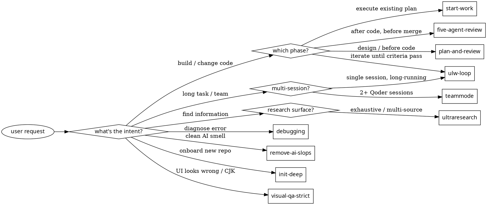

# swarm — Multi-Agent Orchestration Kit

One skill, eleven orchestration patterns. Routes by user intent to the matching reference.

## Lazy-load contract

This file is a ROUTER ONLY. It maps user intent → reference file. The full pattern reference (steps, prompts, agent calls) lives in `references/{pattern}.md` and is loaded via Read tool ONLY when the pattern activates.

Why: keeps SKILL.md small enough to live in the system prompt without burning tokens. With 11 patterns, inlining all of them = 3000+ tokens of dead weight in every session.

Borrowed from anthropics/skills: SKILL.md frontmatter declares purpose, body declares routing, details live in adjacent files loaded on demand.

If you (a future LLM) catch yourself wanting to paste a "Stage 1 — ..." block here, STOP. Add a one-line trigger to the routing table instead.

## When to activate (any of)

| Pattern | Trigger words (EN / 中文) |
|---------|-------------------------|
| `plan-and-review` | "plan this" / "ulw-plan" / "break down" / "规划" / "拆解" + multi-step/ambiguous |
| `five-agent-review` | "review work" / "QA my work" / "审查代码" / "代码审查" |
| `start-work` | "start work" / "execute plan" / "开始干活" / "执行计划" |
| `remove-ai-slops` | "remove slop" / "clean AI code" / "deslop" / "清理AI代码" |
| `init-deep` | "init-deep" / "project memory" / "AGENTS.md" / "项目记忆" |
| `ultraresearch` | "ultraresearch" / "deep research" / "深度研究" / "彻底研究" |
| `debugging` | "debug this" / "why is X broken" / "调试" / "为什么报错" |
| `visual-qa-strict` | "visual QA" / "screenshot diff" / "视觉验证" / "截图对比" / CJK issues |
| `teammode` | "team mode" / "make a team" / "团队模式" / "多人协作" |
| `ulw-loop` | "ulw-loop" / "keep going" / "一直跑到完成" |
| `magentic-loop` | "magentic" / "group conversation" / "群对话" / "speaker selection" / "iterative debate" / "对辩收敛" / multi-agent + complex decision / "讨论收敛" |

### Decision diagram — pick one pattern



Render this with any graphviz tool (or just read the labels) — it's a visualization of the table above, not a separate gate.

## How to execute (universal flow)

1. **Detect pattern** from user message → pick ONE pattern name from the table above.
2. **Read** `references/{pattern}.md` from this skill directory using the Read tool.
3. **Follow the reference** — it specifies stages, parallel groups, subagent types, and exact Agent prompts.
4. **Universal rules** (apply to every pattern):
   - Use the `Agent` tool with the matching `swarm-*` subagent (`swarm-explorer`, `swarm-librarian`, `swarm-planner`, `swarm-reviewer`, `swarm-worker`). See `references/_shared.md` for the role-to-subagent mapping. Fall back to Qoder built-ins (`Explore` / `Plan` / `general-purpose`) only when the `swarm-*` agents are not registered in the current session.
   - Do NOT use the `Workflow` tool (feature-gated on some accounts).
   - Send all independent Agent calls **in a single message** to run them in parallel.
   - Each spawned agent's prompt must be self-contained: `TASK: ... DELIVERABLE: ... SCOPE: ... VERIFY: ...`
   - Save state to `.swarm/{pattern}/` when the reference says so.

## Model tiers — handled by the subagents, not the call site

Qoder's `Agent` tool does NOT accept a `model` parameter. Per-role model selection happens in each `swarm-*` subagent's frontmatter (Qwen3.7-Max-DogFooding for explorer/librarian, ultimate for planner/reviewer, GLM-5.2 for worker). The legacy "CHEAP/MID/HEAVY" labels in reference docs map to which subagent_type you pick:

| Label in references | subagent_type | Default model |
|---------------------|---------------|---------------|
| `CHEAP` | `swarm-explorer` or `swarm-librarian` | `Qwen3.7-Max-DogFooding` |
| `MID`   | `swarm-worker` | `GLM-5.2` |
| `HEAVY` | `swarm-planner` or `swarm-reviewer` | `ultimate` (high effort) |

These are the shipped defaults. To force different specific models (e.g. `Qwen3.7-Max-DogFooding`, `GLM-5.2`), edit the `model:` field in `~/.qoder/agents/swarm-*.md` or use `settings.json` overrides. See the project README's "Customizing swarm-* Subagents" section.

## Composability — skill calls skill

A pattern's reference may instruct you to invoke another pattern. Example:
- `start-work` reference says: "If no plan exists, first run `plan-and-review`."
- Treat this as: read `references/plan-and-review.md`, execute that flow, then continue.

Don't recurse beyond 2 levels (plan → execute → review is the deepest typical chain).

## Files

```
swarm/
├── SKILL.md                          ← this file (routing only)
└── references/
    ├── plan-and-review.md            ← 4-agent planning loop
    ├── five-agent-review.md          ← 5 parallel reviewers
    ├── start-work.md                 ← orchestrate workers in waves
    ├── remove-ai-slops.md            ← lock-then-clean cycle
    ├── init-deep.md                  ← dynamic explorer fleet
    ├── ultraresearch.md              ← swarm + recursive EXPAND
    ├── debugging.md                  ← 3+ hypothesis parallel investigation
    ├── visual-qa-strict.md           ← pixel diff + dual oracle
    ├── teammode.md                   ← persistent multi-session team
    ├── ulw-loop.md                   ← self-loop with evidence ledger
    ├── magentic-loop.md              ← group conversation with speaker selection
    └── _shared.md                    ← TASK template, error handling, retry rules
```

```
swarm/
└── prompts/
    ├── progress-ledger.md            ← progress ledger prompt
    ├── task-ledger-facts.md          ← task ledger facts prompt
    ├── task-ledger-plan.md           ← task ledger plan prompt
    ├── replan.md                     ← replan prompt
    └── context-recovery.md          ← context recovery prompt
```

## Critical: when this skill activates

After deciding which pattern applies:
1. Tell the user briefly: `"Running swarm:<pattern> (using Agent parallel calls, ~Nx credit)"`.
2. Read the reference file.
3. Execute. Don't paraphrase the reference — follow it.

When in doubt between two patterns, pick the more specific one. When user says "just plan and execute and review", chain `plan-and-review` → `start-work` → `five-agent-review`.

## Agent routing preference (applies even WITHOUT activating this skill)

When you are about to use the `Agent` tool for any reason:

| If you would pick... | Instead use... | Why |
|---------------------|---------------|-----|
| `Explore` | **`swarm-explorer`** | Same capability + structured output format + model-tiered (free Qwen) |
| `Plan` | **`swarm-planner`** | Same capability + writes plan to `.swarm/plans/` for resumption |
| `general-purpose` for research | **`swarm-librarian`** | Cited + SHA-pinned evidence |
| `general-purpose` for code changes | **`swarm-worker`** | Smallest correct change + verification evidence |
| `general-purpose` for review | **`swarm-reviewer`** | Structured PASS/REVISE/FAIL verdicts |

The `swarm-*` agents are **supersets** of the built-ins: they have the same tools plus structured output contracts, model-tiered cost savings, and composability with `.swarm/` state. There is no scenario where the built-in is better.

**Exception**: if the task is truly a 1-turn lookup (e.g., "what's in this file?"), using Read/Grep directly without any Agent is the correct choice — don't over-orchestrate.
