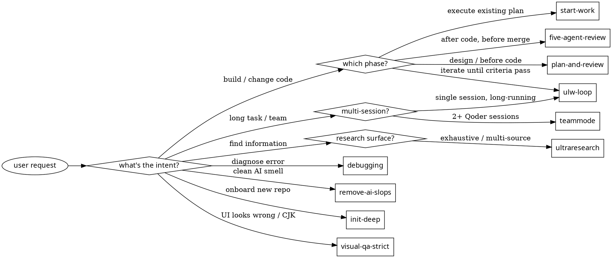

# swarm — Multi-Agent Orchestration Kit

One skill, eleven orchestration patterns. Routes by user intent to the matching reference.

## Lazy-load contract

This file is a ROUTER ONLY. It maps user intent → reference file. The full pattern reference (steps, prompts, agent calls) lives in `references/{pattern}.md` and is loaded via Read tool ONLY when the pattern activates.

Why: keeps SKILL.md small enough to live in the system prompt without burning tokens. With 11 patterns, inlining all of them = 3000+ tokens of dead weight in every session.

Borrowed from anthropics/skills: SKILL.md frontmatter declares purpose, body declares routing, details live in adjacent files loaded on demand.

If you (a future LLM) catch yourself wanting to paste a "Stage 1 — ..." block here, STOP. Add a one-line trigger to the routing table instead.

## When to activate (any of)

| Pattern | Trigger words (EN / 中文) |
|---------|-------------------------|
| `plan-and-review` | "plan this" / "ulw-plan" / "break down" / "规划" / "拆解" / "clarify first" / "先问我" / "scope unclear" / "stress test plan" / "对抗规划" / "hyperplan" / "hostile critic" + multi-step/ambiguous |
| `five-agent-review` | "review work" / "QA my work" / "审查代码" / "代码审查" |
| `start-work` | "start work" / "execute plan" / "开始干活" / "执行计划" |
| `remove-ai-slops` | "remove slop" / "clean AI code" / "deslop" / "清理AI代码" |
| `init-deep` | "init-deep" / "project memory" / "AGENTS.md" / "项目记忆" |
| `ultraresearch` | "ultraresearch" / "deep research" / "深度研究" / "彻底研究" |
| `debugging` | "debug this" / "why is X broken" / "调试" / "为什么报错" |
| `visual-qa-strict` | "visual QA" / "screenshot diff" / "视觉验证" / "截图对比" / CJK issues |
| `teammode` | "team mode" / "make a team" / "团队模式" / "多人协作" |
| `ulw-loop` | "ulw-loop" / "keep going" / "一直跑到完成" |
| `magentic-loop` | "magentic" / "group conversation" / "群对话" / "speaker selection" / "iterative debate" / "对辩收敛" / multi-agent + complex decision / "讨论收敛" |
| `self-improve` | "self-improve" / "evolutionary" / "tournament" / "自进化" / "持续优化" / "benchmark loop" / "optimize metric" / "迭代优化" |

### Decision diagram — pick one pattern



Render this with any graphviz tool (or just read the labels) — it's a visualization of the table above, not a separate gate.

## How to execute (universal flow)

1. **Detect pattern** from user message → pick ONE pattern name from the table above.
2. **Read** `references/{pattern}.md` from this skill directory using the Read tool.
3. **Follow the reference** — it specifies stages, parallel groups, subagent types, and exact Agent prompts.
4. **Universal rules** (apply to every pattern):
   - Use the `Agent` tool with the matching `swarm-*` subagent (`swarm-explorer`, `swarm-librarian`, `swarm-planner`, `swarm-reviewer`, `swarm-worker`). See `references/_shared.md` for the role-to-subagent mapping. Fall back to Qoder built-ins (`Explore` / `Plan` / `general-purpose`) only when the `swarm-*` agents are not registered in the current session.
   - Do NOT use the `Workflow` tool (feature-gated on some accounts).
   - Send all independent Agent calls **in a single message** to run them in parallel.
   - Each spawned agent's prompt must be self-contained: `TASK: ... DELIVERABLE: ... SCOPE: ... VERIFY: ...`
   - Save state to `.swarm/{pattern}/` when the reference says so.

## Model tiers — handled by the subagents, not the call site

Qoder's `Agent` tool does NOT accept a `model` parameter. Per-role model selection happens in each `swarm-*` subagent's frontmatter (Qwen3.7-Max-DogFooding for explorer/librarian, ultimate for planner/reviewer, GLM-5.2 for worker). The legacy "CHEAP/MID/HEAVY" labels in reference docs map to which subagent_type you pick:

| Label in references | subagent_type | Default model |
|---------------------|---------------|---------------|
| `CHEAP` | `swarm-explorer` or `swarm-librarian` | `Qwen3.7-Max-DogFooding` |
| `MID`   | `swarm-worker` | `GLM-5.2` |
| `HEAVY` | `swarm-planner` or `swarm-reviewer` | `ultimate` (high effort) |

These are the shipped defaults. To force different specific models (e.g. `Qwen3.7-Max-DogFooding`, `GLM-5.2`), edit the `model:` field in `~/.qoder/agents/swarm-*.md` or use `settings.json` overrides. See the project README's "Customizing swarm-* Subagents" section.

## Composability — skill calls skill

A pattern's reference may instruct you to invoke another pattern. Example:
- `start-work` reference says: "If no plan exists, first run `plan-and-review`."
- Treat this as: read `references/plan-and-review.md`, execute that flow, then continue.

Don't recurse beyond 2 levels (plan → execute → review is the deepest typical chain).

## Files

```
swarm/
├── SKILL.md                          ← this file (routing only)
└── references/
    ├── plan-and-review.md            ← 4-agent planning loop
    ├── five-agent-review.md          ← 5 parallel reviewers
    ├── start-work.md                 ← orchestrate workers in waves
    ├── remove-ai-slops.md            ← lock-then-clean cycle
    ├── init-deep.md                  ← dynamic explorer fleet
    ├── ultraresearch.md              ← swarm + recursive EXPAND
    ├── debugging.md                  ← 3+ hypothesis parallel investigation
    ├── visual-qa-strict.md           ← pixel diff + dual oracle
    ├── teammode.md                   ← persistent multi-session team
    ├── ulw-loop.md                   ← self-loop with evidence ledger
    ├── magentic-loop.md              ← group conversation with speaker selection
    ├── self-improve.md               ← evolutionary tournament optimization
    └── _shared.md                    ← TASK template, error handling, retry rules
```

```
swarm/
└── prompts/
    ├── progress-ledger.md            ← progress ledger prompt
    ├── task-ledger-facts.md          ← task ledger facts prompt
    ├── task-ledger-plan.md           ← task ledger plan prompt
    ├── replan.md                     ← replan prompt
    └── context-recovery.md          ← context recovery prompt
```

## Critical: when this skill activates

After deciding which pattern applies:
1. Tell the user briefly: `"Running swarm:<pattern>"`.
   At EACH stage transition, emit a **progress line** (one sentence, not a paragraph):
   - `"Stage 0.5 → interview (3 ambiguities detected, asking clarification)"`
   - `"Stage 1 → parallel research (explorer + librarian dispatched)"`
   - `"Stage 2 → planning (from 2 research reports, writing plan.md)"`
   - `"Stage 3 → gap analysis"`
   - `"Stage 3.5 → hyperplan hostile critic"`
   - `"Stage 4 → reviewer verdict: OKAY"`
   - `"Wave 1 → dispatching T1, T4, T6 (3 parallel workers)"`
   - `"Wave 1 done → 3/3 PASS. Wave 2 → T2, T3 (2 workers)"`
   - `"5-agent review → 5/5 PASS"`
   - `"Auto-committing + pushing (per auto-execution boundary)"`
   This is the lightweight HUD. No status bar widget, no fancy rendering — just one-line echoes that tell the user where we are without them needing to read .swarm/ files.
2. Read the reference file.
3. Execute. Don't paraphrase the reference — follow it.

When in doubt between two patterns, pick the more specific one. When user says "just plan and execute and review", chain `plan-and-review` → `start-work` → `five-agent-review`.

## Auto-execution boundary (after review PASSES)

When any adversarial review stage returns a positive verdict — Hyperplan `ROBUST`, Stage 4 Reviewer `OKAY`, five-agent-review `5/5 PASS` or `4/5 PASS` — the orchestrator has a green light to proceed WITHOUT asking the user. But green light ≠ blanket auto-pilot. Auto-execute only reversible actions; stop and ask for irreversible ones.

### ✅ Auto-execute (reversible — can be undone with git reset / rm / edit)

- Local file modifications (agents write to disk)
- `git add` + `git commit` to local branch
- `git push` to the current branch's remote (assumes non-main; if main and no other reviewer gate, still auto — treat push as reversible via git revert)
- Run smoke / eval / verify-models / any local test
- Write memory to `.swarm/memory/`
- Advance to the next swarm stage (plan-and-review → start-work → five-agent-review)
- Generate reports / artifacts under `.swarm/` or `docs/`

### ⛔ Stop and ask user (irreversible / external / broad blast radius)

- Any deployment or production release
- Sending messages: ATA article publish, DingTalk push, email, MR/PR creation for team review
- Modifying shared infrastructure: hooks / settings.json / CI config / global env
- `rm -rf` on tracked files, `git push --force`, `git reset --hard` on shared branch
- Modifying files OUTSIDE the plan.md's declared `files:` field
- Installing packages / running `npm install` / `pip install` on user's system
- Cross-session operations affecting other users
- Anything the pattern reference explicitly marks "user confirmation required"

### 🟡 Grey zone (surface briefly, proceed by default unless user objects)

- `git push` to main when it's the user's own repo AND CI is green
- Writing new files under user's `~/.qoder/` or `~/.claude/` config dirs
- Creating new branches

### Why

- Reviewers are the gate. If the review says PASS, asking the user again is asking them to override reviewers — which they usually can't judge better than the reviewers themselves.
- Reversible local work: `git reset --hard HEAD~1` costs 1 command. Reversing an ATA publish costs a lot more.
- Reduce user micromanagement. The pattern users want is "swarm went from plan to reviewed commit — anything to do differently?"

### How the orchestrator implements this

After a review verdict:

```
if verdict in [ROBUST, OKAY, 5/5-PASS, 4/5-PASS]:
    is_reversible = check_actions_are_reversible(next_stage_actions)
    if is_reversible:
        proceed_without_asking()
        emit_progress_message("Stage X passed → proceeding to stage Y")
    else:
        ask_user("Review passed. Next action <Z> is irreversible: <describe>. Proceed?")
else:  # NEEDS-FIX, REJECT, 2/5-PASS
    report_to_user_and_wait()
```

Anti-pattern: asking "commit? push?" after every stage. Reviewers already approved — asking again defeats their purpose.

Anti-pattern: auto-pushing without ANY summary to user. Even for reversible actions, emit a short progress line so the user knows what happened.

## Agent routing preference (applies even WITHOUT activating this skill)

When you are about to use the `Agent` tool for any reason:

| If you would pick... | Instead use... | Why |
|---------------------|---------------|-----|
| `Explore` | **`swarm-explorer`** | Same capability + structured output format + model-tiered (free Qwen) |
| `Plan` | **`swarm-planner`** | Same capability + writes plan to `.swarm/plans/` for resumption |
| `general-purpose` for research | **`swarm-librarian`** | Cited + SHA-pinned evidence |
| `general-purpose` for code changes | **`swarm-worker`** | Smallest correct change + verification evidence |
| `general-purpose` for review | **`swarm-reviewer`** | Structured PASS/REVISE/FAIL verdicts |

The `swarm-*` agents are **supersets** of the built-ins: they have the same tools plus structured output contracts, model-tiered cost savings, and composability with `.swarm/` state. There is no scenario where the built-in is better.

**Exception**: if the task is truly a 1-turn lookup (e.g., "what's in this file?"), using Read/Grep directly without any Agent is the correct choice — don't over-orchestrate.
